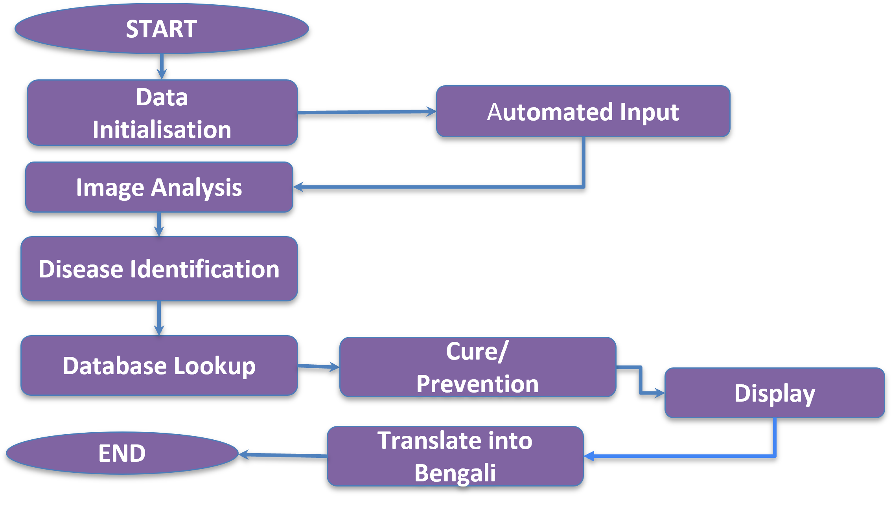

# IoT-Enhanced Crop Disease Detection System 🌱

This project presents a **low-cost, multilingual, offline-operable crop disease detection system** designed to support farmers in rural and under-resourced agricultural regions. By combining **deep learning (MobileNetV2 CNN)** with **edge deployment** on Raspberry Pi, the system enables **real-time leaf disease diagnosis** without requiring internet connectivity.

The solution provides **text and audio-based guidance in both English and Bengali**, ensuring accessibility for farmers across different literacy levels.

## Key Features

| Feature | Description |
|--------|-------------|
| **On-Device Disease Detection** | Uses TensorFlow Lite optimized **MobileNetV2 CNN** to classify crop leaf diseases offline |
| **Camera-Based Image Capture** | Captures live leaf images using Pi Camera / external webcam |
| **Multilingual Output** | Displays and reads instructions in **English & Bengali** |
| **OLED Display + Speaker Output** | Shows text on-screen and narrates treatment steps |
| **No Internet Required** | Designed specifically for remote agricultural regions |
| **Environmentally Sustainable** | Helps reduce excessive pesticide usage |

---

## Machine Learning Overview

- **Model Type:** Convolutional Neural Network (CNN)
- **Architecture Used:** **MobileNetV2**
- **Training Paradigm:** **Supervised Learning**
- **Loss Function:** Categorical Cross Entropy  
- **Optimizer:** **Adam**
- **Deployment Format:** **TensorFlow Lite (.tflite)** for Raspberry Pi
- **Data Augmentation Techniques Used:**
  - Rotation
  - Zoom / Random Cropping
  - Horizontal Flip
  - Brightness & Contrast Adjustment
  - Normalization to `(0,1)`

---

## System Workflow

The overall system workflow from data input to user guidance is illustrated below:

---

## Required Libraries

| Library | Purpose |
|--------|---------|
| `tensorflow / tflite_runtime` | Model loading & inference |
| `opencv-python (cv2)` | Image capture & preprocessing |
| `numpy` | Array operations |
| `PIL` (Pillow) | Image formatting |
| `pygame / gTTS` | Text-to-Speech audio playback |
| `Adafruit_SSD1306` | OLED display control (for Pi version) |
| `RPi.GPIO` | Hardware pin control (if required) |

## Supported Crops & Diseases

| Crop Name | Detected Diseases | Notes |
|----------|------------------|-------|
| Potato   | Late Blight, Early Blight | Model trained using PlantVillage dataset |
| Tomato   | Leaf Mold, Septoria Leaf Spot, Target Spot | Works best in daylight leaf images |
| Rice     | Brown Spot, Leaf Blast | Can be extended to more paddy diseases |
| Maize    | Common Rust, Leaf Blight | Field-tested sample images included |

> Additional crops and diseases can be added by retraining or fine-tuning the model.

---

## Project Status

| Component | Status | Details |
|----------|--------|---------|
| Model Training | ✅ Completed | MobileNetV2 fine-tuned on PlantVillage Dataset |
| Backend (Flask API) | ✅ Completed | Handles image classification requests |
| OLED + Audio Output System | ✅ Working Prototype | Local language text & speech implemented |
| Cloud / Dashboard for Disease Mapping | 🟧 Planned | To enable regional disease pattern analysis |

---

## Contributors

- **Poulami Sarkar**
- **Navoneel Dey**
- **Adrija Ghosh**
- **Oindrilla Mishra**
- **Sabuj Bhattacharya**
